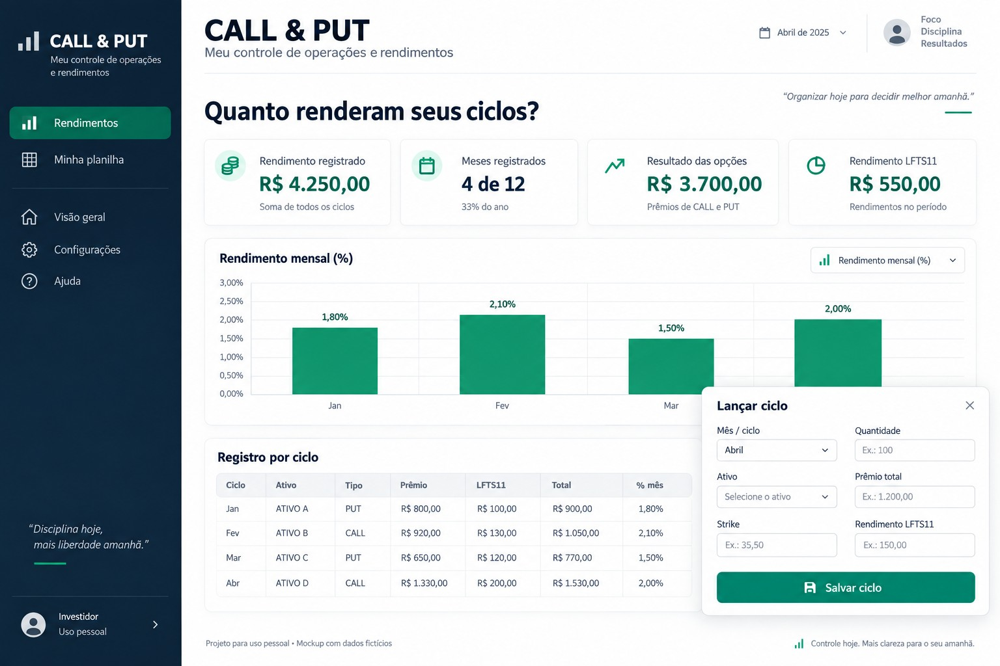

# Meu Controle — Opções

[Explorar demonstração](https://meu-controle-opcoes.vercel.app/)

Controle privado de CALL, PUT e rendimentos de LFTS11. Duas páginas: Rendimentos e Minha planilha. Uma linha por ciclo reúne os mesmos campos da planilha original, com edição e exportação CSV. JavaScript, Node.js 24, PostgreSQL/Neon e Vercel. A demonstração pública contém apenas exemplos fictícios.

## Critérios

- Valores monetários em centavos; quantidade representa opções, não lotes.
- O prêmio total confirmado prevalece sobre o preço unitário arredondado.
- A visão principal é por mês/ciclo de referência, não por data de liquidação. Inclui os ciclos ainda não encerrados, como a planilha original. Não é uma apuração fiscal nem de lucro realizado.
- Resultado registrado de opção vendida: prêmio recebido menos recompra e custos informados. Comprada: venda de encerramento menos prêmio pago e custos informados. Expirada: valor de encerramento zero. Custos não informados permanecem nulos, sem abatimento presumido.
- Rendimento total do ciclo = resultado registrado da opção + rendimento de LFTS11 informado na mesma linha. Campo de rendimento em branco permanece nulo e não acrescenta valor.
- Base do percentual = strike em centavos × quantidade; não é a garantia. Percentual da opção = resultado da opção/base. Percentual total = rendimento total/base.
- Mais de uma linha no mês: soma de rendimentos dividida pela soma das bases. Nunca somar percentuais das linhas. Reutilização de capital não é modelada como retorno efetivo do patrimônio.
- Acumulado em reais é a soma dos ciclos no ano. Acumulado composto é o produto de (1 + taxa mensal) menos 1, sem arredondar taxas intermediárias. Meses sem registros permanecem ausentes. É uma equivalência dos ciclos lançados, não retorno efetivo da carteira com fluxos de aportes, nem projeção de 12 meses. Taxas parciais e meses faltantes são indicados.
- Exercícios ficam registrados, sem inferir o resultado da posição em ações ou apuração fiscal.
- A situação da opção não impede exibir o rendimento registrado do ciclo. Vencimento passado não encerra automaticamente operações. Garantia é uma coluna informativa separada da base dos percentuais.
- Importações sem data de abertura usam primeiro dia do ciclo como referência, indicado nas observações. Nenhuma cotação ao vivo ou recomendação de investimento.

## Executar

Copie `.env.example` para `.env` e configure o banco, salt e hash scrypt do administrador. Não existe cadastro público de usuário nem tela pública para criar senha. `npm install`, `npm run migrate`, `npm run dev`. `npm test` valida cálculo por ciclo, totais com exemplos fictícios, composição anual, meses ausentes, múltiplas operações, perdas, metadados e entradas inválidas.

Tabelas `op_*` para os registros e sessões. Autenticação por sessão HttpOnly, rate limit persistente, validação de origem, consultas parametrizadas, concorrência por versão, idempotência e histórico de alterações. Arquivamentos preservam registros no banco.

